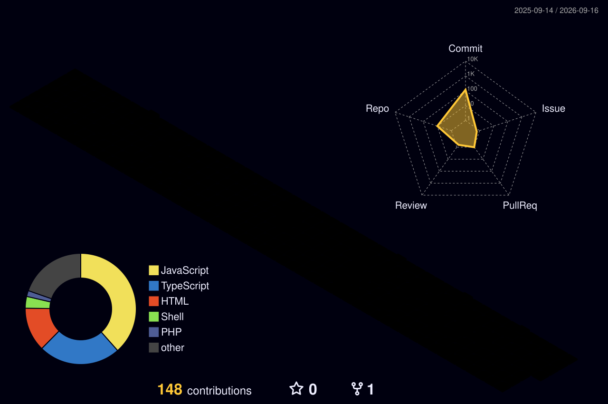

  

  

<b> About Me</b>

 

- 🏫 I am a `Student` at [Institute San Ignacio Loyola](https://isil.pe/).
- 🚀 I love using Software as a solution for every `Problem`.
- 🤖 I belong to a `new generation` of programmers `strengthened` by `AI`.
- 📚 I’m currently learning `Software Engineering`.
- 🧠 A perpetual student of `technology`, building tomorrow's web `today`. 
- 💼 I’m currently open for a new `job opportunity`, this is [MY PORTFOLIO](https://guillermoaliaga.vercel.app/).
- 🖤 I don't just `solve problems`; I live for the `'Aha!'` moment when everything clicks.
- ☕ `Java` lover.
  

<b> My Tech Stack</b>

 

<h3 align="center">🚀 Programming Languages</h3>

  &nbsp;&nbsp;
  &nbsp;&nbsp;
  &nbsp;&nbsp;
  &nbsp;&nbsp;
  &nbsp;&nbsp;
  &nbsp;&nbsp;
  

<h3 align="center">🎨 Frontend Development</h3>

  &nbsp;&nbsp;
  &nbsp;&nbsp;
  &nbsp;&nbsp;
  &nbsp;&nbsp;
  &nbsp;&nbsp;
  &nbsp;&nbsp;
  &nbsp;&nbsp;
  &nbsp;&nbsp;
  

<h3 align="center">⚙️ Services & Frameworks</h3>

  &nbsp;&nbsp;
  &nbsp;&nbsp;
  

<h3 align="center">🗄️ Databases</h3>

  &nbsp;&nbsp;
  &nbsp;&nbsp;
  &nbsp;&nbsp;
  &nbsp;&nbsp;
  

<h3 align="center">☁️ SRE & DevOps</h3>

  &nbsp;&nbsp;
  &nbsp;&nbsp;
  &nbsp;&nbsp;
  &nbsp;&nbsp;
  

<h3 align="center">🛠️ Misc Tools</h3>

  &nbsp;&nbsp;
  &nbsp;&nbsp;
  &nbsp;&nbsp;
  &nbsp;&nbsp;
  &nbsp;&nbsp;
  &nbsp;&nbsp;
  &nbsp;&nbsp;
  &nbsp;&nbsp;
  &nbsp;&nbsp;
  &nbsp;&nbsp;
  &nbsp;&nbsp;
  &nbsp;&nbsp;
  &nbsp;&nbsp;
  

<b> Git Activeness</b>

  

 

<b> Connect With Me</b>

 
  &nbsp;&nbsp;
  &nbsp;&nbsp;
  &nbsp;&nbsp;
  

 

&nbsp;&nbsp;&nbsp;&nbsp;  

&nbsp;&nbsp;&nbsp;&nbsp;  

